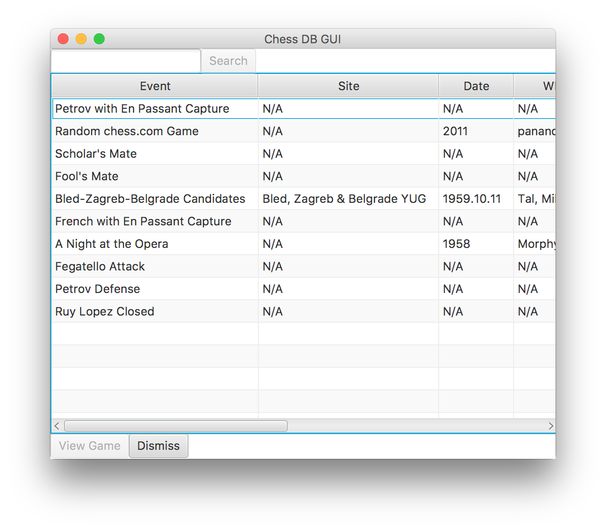
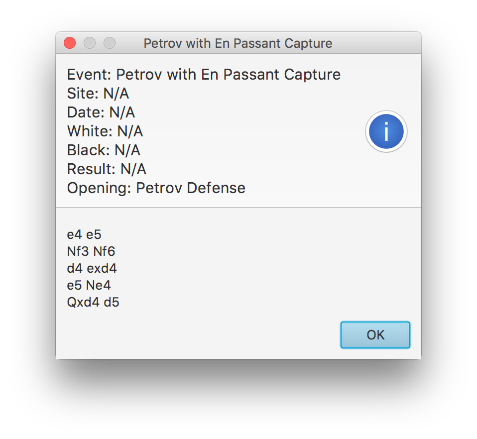

# Projects

___

## Interactive Resume

In my Interactive Resume app, I used UI Kit and Xcode's interface builder to make an interactive resume. The user is able to navigate through pages to get to different parts of the resume. It includes screenshots of different projects that I have worked on, and more traditional components of a resume like work experience and education.

    
    

## Command Line PGN Reader

This project was created as a homework assignment for my Intro to Object Oriented Programming class. The purpose of the assignment was to create a program that reads text from a PGN file containing the moves of an already played chess game and returns the final position of all of the pieces on the board in FEN notation. For the assignment, I was only allowed to use one class and the java.lang package, which resulted in a single file with over 500 lines of code. This project was modified throughout the duration of the course and ultimately resulted in a JavaFX application that displayed a database of Chess Games in PGN notation if the PGN files were in the same directory as the application. This program displayed the metadata for each game and displayed more information on the game when a row is selected and View Game is pressed. It also had a search feature and could detect several famous openings from any chess games displayed.

    
    

## Emoji Chess

I created this app using Xcode, Swift, and SpriteKit. It is still a (big) work in progress, but at some point both player v. computer and player v. player games will be able to be played in the app.

## Block Dodger

I created this app for HackGT 2017 at the last minute of the competition. I submitted the app and demoed it at the hackathon. A black block is "falling" in the game and the player's objective is to avoid all of the red blocks.

